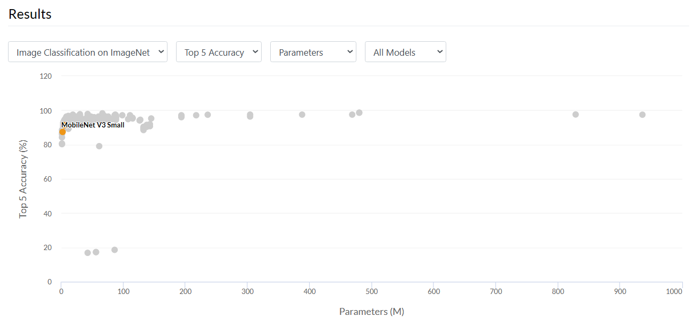
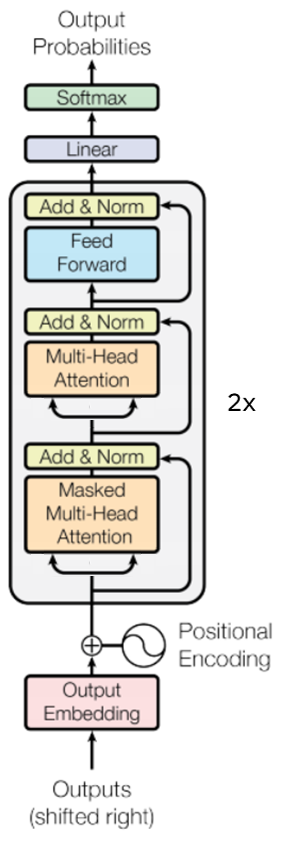
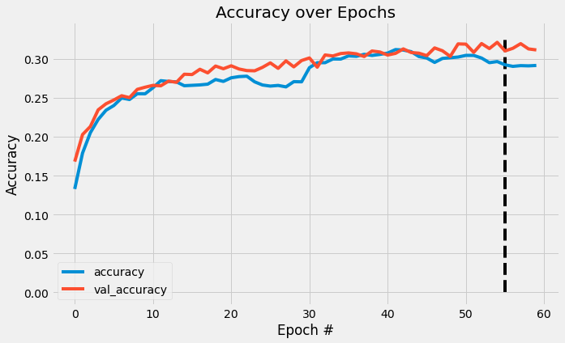
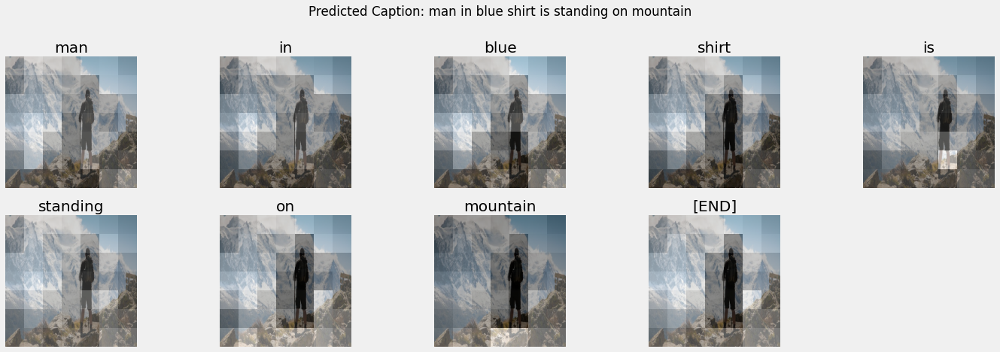
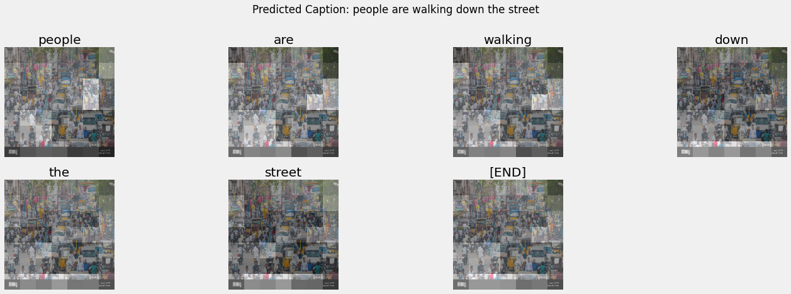

# Image Caption Generator

## Introduction

It has been a fantastic learning journey over the course of the 12-week Data Science Immersive with General Assembly, from learning the basics of Python to getting acquainted with machine learning through scikit-learn. With the prescribed course projects covering various aspects of machine learning such as regression and classification problems, I wanted to venture further and explore deep learning with larger datasets. With a variety of tutorials available, TensorFlow and Keras seemed like a good place to start.

Image caption generation allows a machine to generate a sentence in natural language that describes the context of an image. While seemingly mundane, this could have wider applications in various fields, such as assisting the visually impaired by explaining images through text-to-speech systems or perhaps used to tag and organise photos in a library.

Personally, as a photography hobbyist, when sharing my [photographs](https://flickr.com/photos/ee_shawn/), I like to pair them with some text that perhaps provides some context to the image and enhances appreciation. It would be interesting if I could train a model that analyses an image and automatically generates a descriptive caption providing some history or information about the image based on the location.

This would likely be a rather complex task, so to start off with the first step into my deep learning journey: training a supervised model that is capable of generating a simple caption based on detected objects within the image.

### Background

Attention is a cognitive ability that humans have to selectively concentrate on a discrete aspect of information while ignoring other perceivable information. When applied to deep learning, the use of an attention mechanism similarly allows a machine to focus on the most relevant parts of a sequence when making a prediction.

The model architecture used here is based on the TensorFlow [tutorial](https://www.tensorflow.org/tutorials/text/image_captioning), inspired by [Show, Attend and Tell: Neural Image Caption Generation with Visual Attention](https://arxiv.org/abs/1502.03044) and updated to use a 2-layer Transformer-decoder.

## Problem Statement

To train an attention mechanism-based caption generator that is able to generate a descriptive caption of an image with a BLEU-1 score of at least 0.5.

## Gathering the Data

There are various available datasets that are suitable for the purpose of our training, but I will be utilising the [Flickr30k](https://www.kaggle.com/datasets/eeshawn/flickr30k) dataset in this project, a popular free dataset for use with image caption generation. The dataset consists of 158,915 crowd-sourced captions describing 31,783 images. The dataset is still relatively small enough for us to be able to train in a Google Colab environment or local machine without an extensive training duration.

Larger and more robust datasets to consider include Microsoft's [COCO Captions](https://cocodataset.org/) dataset with over 1.5 million captions describing over 330,000 images or even Google's [Conceptual Captions Dataset](https://ai.google.com/research/ConceptualCaptions/) with around 3.3 million image and caption pairs! However, the size of these datasets would also require significantly higher resources and computation power to complete training.

## Preparing the Dataset

The data is converted into the TensorFlow dataset format to better optimise the training workflow with a data pipeline. As the data is too large to be handled by the memory at once, leveraging upon various features of the `tf.data` API will allow for more efficient training.

1. Perform preprocessing steps - feature extraction and tokenization of captions
1. Batching of elements in the dataset
1. Shuffling of elements
1. Prefetching later elements to optimise training flow

The dataset will be split into 3: train, validation and test sets. Train and validation will be used by the model during training, while the test set will be set aside for final evaluation.

### Image Feature Extraction

Using transfer learning with a pre-trained image classifier model, we can extract the features from our images.

The MobileNet V3 Small model that I will be using for feature extraction takes an input image shape of 224 x 224 pixels and 3 x RGB channels (224, 224, 3), so images need to be resized before passing into the model. Since I am not trying to perform classification, `include_top=False` returns the model without the final classification layer and allows me to extract a feature map from the image.

[Image Source](https://paperswithcode.com/lib/torchvision/mobilenet-v3)

While there are various image classifier models that are available, MobileNet V3 was developed by Google researchers for use with mobile devices, so it offers relatively high performance for a low number of parameters.

### Set Up TextVectorization Layer

A TextVectorization layer will be used to transform our text captions into integer sequences. As mentioned previously, we will cap the vocabulary size of this layer to use only the top 6,000 most frequent words in the captions.

- Use adapt to iterate over all training captions, split the captions into words, and compute a vocabulary of the top 6,000 most frequent words.
- Attach a `[START]` prefix and `[END]` suffix to our captions to allow to determine the start and end of our captions.
- Tokenize all captions by mapping each word to its index in the vocabulary.
- Create word-to-index and index-to-word mappings to display results.

## Model Setup

Since I am using the pre-trained MobileNet as an image encoder, the model will be focusing on text decoding using a 2-layer Transformer-decoder, taking reference from the TensorFlow [tutorial](https://www.tensorflow.org/tutorials/text/image_captioning), implementing the model using a model subclass API.

The model will be implemented in three main parts:

1. Input - The token embedding and positional encoding (SeqEmbedding).
1. Decoder - A stack of transformer decoder layers (DecoderLayer) where each contains:
    1. A causal self attention later (CausalSelfAttention), where each output location can attend to the output so far.
    1. A cross attention layer (CrossAttention) where each output location can attend to the input image.
    1. A feed forward network (FeedForward) layer which further processes each output location independently.
1. Output - A multiclass-classification over the output vocabulary.

Image adapted from TensorFlow [tutorial](https://www.tensorflow.org/text/tutorials/transformer)

### Training

Since the dataset is too large to pass into the model at once, I will be training the model with a mini-batch gradient descent with a batch size of 32. The standard definition of an epoch is when the model has passed through the full dataset once. With 24,576 samples in our train dataset, the model completes each epoch in 768 batches. Instead, we will specify the `steps_per_epoch` and allow the model to loop through our shuffled dataset on repeat to introduce some variance into the samples seen by the model in each epoch.

While we have set the model to train for 100 epochs, it is likely that the model will stop training early once the `early_stop` callback kicks in.

Training stopped after completing epoch 60, after no improvement to the accuracy score on the validation set for 5 epochs.

## Evaluating Model Performance

The BLEU score is a commonly used measure for the performance of an image caption generator. Originally developed to measure the performance of language translation models, it compares the similarity between a hypothesis statement and reference statements based on n-grams. It returns a score between 0 to 1, where 1 indicates high similarity between the two.

For my purpose, the BLEU score can be used to compare how similar the predicted captions are with the original captions in the test dataset.

|Metric|Score|
|---|---|
|BLEU-1|0.5205|
|BLEU-2|0.3188|
|BLEU-3|0.1994|
|BLEU-4|0.1183|

Based on 1,000 samples from the test dataset, the model is performing relatively well, with a BLEU-1 score of 0.52, above the 0.4 target. Some caption samples from the model:

[Original image](https://www.westernunion.com/blog/wp-content/uploads/2016/12/Hiking-Cover-e1481132901201.jpg)

[Original Image](https://c8.alamy.com/comp/DB00NR/busy-street-in-madurai-india-DB00NR.jpg)

## Future Work

Beyond the scope of this current project, there are opportunities to further refine and enhance on the capabilities of the model.

1. The choice of MobileNet as my feature extraction model allowed for more efficient training of my model without excessive wait times due to limited computation power and time. For subsequent training, it would be possible to utilise a different pre-trained model that has higher prediction accuracy and/or a higher output complexity. Since this provides the input to our caption generator, the model could better pick up on features and details within the image.

1. As can be seen in the predicted captions, any deep learning model is constrained by the dataset it sees. Given limited processing power and time, the current model was trained on the Flickr30k dataset but could easily be scaled up to train on the COCO or even Conceptual Captions datasets to enhance it's generalisability.

1. Due to limited time, I did not have the opportunity to perform any hyperparameter tuning. While the model was able to perform satisfactorily, it is possible that it could have performed even better given some fine tuning.

## Conclusion

The trained model is able to generate a relatively good descriptive caption for images and achieved a BLEU-1 score of 0.52 based on the test samples. While there is definitely room for improvement, this feels like a good first step in my deep learning journey and I am excited to try out other projects!

## Resources

- Brownlee, J. (2022, August 15). Difference between a batch and an epoch in a neural network. MachineLearningMastery.com. Retrieved January 20, 2023, from https://machinelearningmastery.com/difference-between-a-batch-and-an-epoch/ 

- Doshi, K. (2021, May 11). Foundations of NLP explained - bleu score and wer metrics. Medium. Retrieved January 20, 2023, from https://towardsdatascience.com/foundations-of-nlp-explained-bleu-score-and-wer-metrics-1a5ba06d812b

- Doshi, K. (2021, April 30). Image Captions with Attention in Tensorflow, Step-by-step. Medium. Retrieved January 20, 2023, from https://towardsdatascience.com/image-captions-with-attention-in-tensorflow-step-by-step-927dad3569fa

- Gautam, T. (2020, November 20). Attention mechanism for image caption generation in Python. Analytics Vidhya. Retrieved January 20, 2023, from https://www.analyticsvidhya.com/blog/2020/11/attention-mechanism-for-caption-generation/ 

- Image captioning with visual attention: TensorFlow Core. TensorFlow. (2022). Retrieved January 20, 2023, from https://www.tensorflow.org/tutorials/text/image_captioning 

- Kishore Papineni, Salim Roukos, Todd Ward, and Wei-Jing Zhu. 2002. BLEU: a method for automatic evaluation of machine translation. In Proceedings of the 40th Annual Meeting on Association for Computational Linguistics (ACL '02). Association for Computational Linguistics, USA, 311–318. https://doi.org/10.3115/1073083.1073135

- Neural machine translation with a transformer and Keras. TensorFlow. (2022). Retrieved January 20, 2023, from https://www.tensorflow.org/text/tutorials/transformer

- Peter Young, Alice Lai, Micah Hodosh, Julia Hockenmaier; From image descriptions to visual denotations: New similarity metrics for semantic inference over event descriptions. Transactions of the Association for Computational Linguistics 2014; 2 67–78. doi: https://doi.org/10.1162/tacl_a_00166
